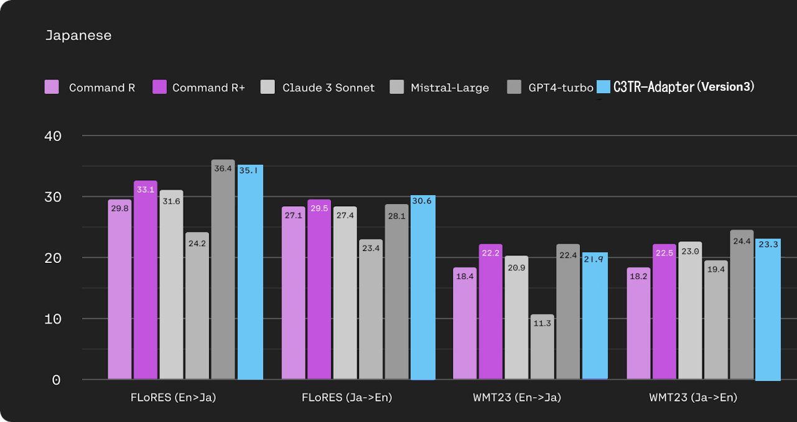

# JTransBench

機械翻訳モデルの日本語翻訳ベンチマークスコアを簡単に測定するためのツール群  
A set of tools to easily measure the Japanese translation benchmark scores of machine translation models

## セットアップ(Setup)

(1) 仮想環境作成(option) (Create a virtual environment (optional))

```
python3 -m venv venv
source venv/bin/activate
```

(2)ライブラリのインストール (Installing libraries)

```
git clone https://github.com/webbigdata-jp/JTransBench
cd JTransBench
git submodule update --init --recursive
pip install -r requirements.txt
```

ライブラリのインストールで何かトラブルがあったら謝辞一覧に記載した参照元プロジェクトのドキュメントを見ると解決が早いかもしれません。  
本プロジェクトは特殊な事はやっていません   

If you have any trouble installing the library, you may be able to find a solution quickly by looking at the documentation for the reference projects listed in the acknowledgements.  
This project is not doing anything special.   

## 簡単な使い方 (How to use simple version)

```
# (1)datasets download
python3 1_datasetup.py

# (2)Translate in your environment
# Translate in your environment
# Copy any .ref and .src files under dataset/use to work/ and save the translation results as a .hyp file.
# There are sample scripts for transformers(2_1_transformer_translate_sample.py) and gguf(2_2_gguf_translate_sample.py)
#
# dataset/use配下の好きな.refファイルと.srcファイルをwork/配下にコピーし、翻訳結果を拡張子hypファイルとして保存する
# transformers用(2_1_transformer_translate_sample.py)とgguf用(2_2_gguf_translate_sample.py)のサンプルスクリプトがあります

# for example
# mkdir work
# cp dataset/use/<your_target_file>.src ./work
# cp dataset/use/<your_target_file>.ref ./work
# python3 2_1_transformer_translate_sample.py  --input work --output work --config conf/2_1_transformer_translate_sample.conf

# (3)Running the benchmark
python3 3_eval.py

# (4)show result
python3 4_result.py

```

## 使い方 詳細版 (How to use detailed version)

### (1)データセットのダウンロード(Download the dataset)

```
python3 1_datasetup.py
```

これによりflores200データセットがdataset/original以下にダウンロードされます。  
This will download the flores200 dataset into the dataset/original directory.  

更にtokenizer用のモデルがmodels配下にダウンロードされます。  
In addition, the model for tokenizer will be downloaded under models.   

external/NTREX/NTREX-128にNTREX-128の全データがcloneされます。  
All data of NTREX-128 will be cloned to external/NTREX/NTREX-128.

更に見分けやすいように名称を変更した flores200, wmt22, wmt23, NTREX-128の各テストセットがdataset/use以下にコピーされます。  
The test sets flores200, wmt22, wmt23, and NTREX-128 whose names have been changed to make them easier to distinguish, are copied to the dataset/use directory.  


例えばflores200v1-enjaとはflores200を英日翻訳用に名称変更したデータ。flores200v1-enja.srcが元の英語文。flores200v1-enja.refが参照用の日本語訳文  
For example, flores200v1-enja is the data of flores200 renamed for English-Japanese translation. flores200v1-enja.src is the original English text and flores200v1-enja.ref is the Japanese translation for reference.  

```
行数(line number) ファイル名(file name)
1012 flores200v1-enja.ref
1012 flores200v1-enja.src
1012 flores200v1_jaen.ref
1012 flores200v1_jaen.src
2037 wmt22_enja.ref
2037 wmt22_enja.src
2008 wmt22_jaen.ref
2008 wmt22_jaen.src
2074 wmt23_enja.ref
2074 wmt23_enja.src
1992 wmt23_jaen.ref
1992 wmt23_jaen.src
1997 NTREX-128_enja.ref
1997 NTREX-128_enja.src
```

全部テストするのはかなり時間がかかるので必要なデータだけをwork配下にコピーするのが良いでしょう  
Testing everything takes a lot of time, so it's a good idea to copy only the data you need to work.

自分自身のデータセットを使う際は下記の命名規則に合わせる必要があります  
If you use your own datasets, they must adhere to the following naming conventions.

```
元の文章: <データセット名称_(enja or jaen).src>
参照翻訳: <データセット名称_(enja or jaen).ref>

Original text: <Dataset name_(enja or jaen).src>
Reference translation text: <Dataset name_(enja or jaen).ref>
```

### (2)翻訳(Translate)

翻訳作業はあなた独自のモデル／環境で実施する事ができます  
You can translate in your own model/environment you like.

もし、flores200v1_enja.srcを翻訳した場合は  
```
flores200v1_enja.hyp 
```
と言う名称でworkディレクトリ配下に保存してください

If you translated flores200v1_enja.src, save it as 
```
flores200v1_enja.hyp
```
in the work directory.

翻訳作業終了時には
- 同名で拡張子だけ異なるsrc, ref, hypの3種類のファイルがwork配下に存在する
- 各ファイルは同じ行数
になっている必要があります

When the translation is complete,
- Three files with the same name but different extensions, src, ref, and hyp, must exist in the work directory.
- Each file must have the same number of lines.

以下はtransformers形式とgguf形式のモデルで翻訳を実施する際のサンプルスクリプトです  
conf配下に格納されている設定ファイルを適宜改変し、ご自分のモデルを動かしてください

Below is a sample script for translating models in transformers and gguf formats.
Please modify the configuration file stored under conf as appropriate and run your own model.


#### 2_1_transformer_translate_sample.py
同名の設定ファイルがconf以下にあるので適宜変更してください  
There is a configuration file with the same name under conf, so please change it as appropriate.  

実行には以下のライブラリの追加インストールが必要になる事があります  
To run this program, you may need to install the following libraries  

```
pip install peft
pip install bitsandbytes

python3 2_1_transformer_translate_sample.py  --input work --output work --config conf/2_1_transformer_translate_sample.conf

```


#### 2_2_gguf_translate_sample.py
同名の設定ファイルがconf以下にあるので適宜変更してください
There is a configuration file with the same name under conf, so please change it as appropriate.  

実行には[llama.cpp](https://github.com/ggerganov/llama.cpp)のインストールが必要です  
[llama.cpp](https://github.com/ggerganov/llama.cpp) must be installed to run.  

```
ln -s <your_llama.cpp_directory>/llama.cpp/build/bin/llama-cli .
ln -s <your_gguf_modelllama>C3TR-Adapter.Q4_K_M.gguf .

python3 2_2_gguf_translate_sample.py --input work --output work --conf conf/2_2_gguf_translate_sample.conf
```

### (3)評価(eval)

```
python 3_eval.py
```

spBLEU, chrF2++, cometの三指標で評価をおこないます  
Evaluation is based on three metrics: spBLEU, chrF2++, and comet.  

spBLEUは最もよく使われているBLEUスコアの改良版です  
spBLEU is an improved version of the most popular BLEU score.

chrF2++は短いテキストや文法が異なる言語間での翻訳評価に適しています  
chrF2++ Suitable for evaluating short texts and translations between languages with different grammar.

cometは深層学習ベースのモデルで人間の評価に近いとされています。  
Comet is a deep learning-based model that is said to be close to human evaluation.  

cometの実行にはGPUが必須です。  
A GPU is required to run comet.  

cometは複数種類が存在しますが、ここでは最初に発表されたcomet(wmt22-comet-da)、改良版のXCOMET-XL, XCOMET-XXLを対象にします。
後者の２モデルは利用申請が必要です。  
- [huggingfaceでアカウントを作成](https://huggingface.co/join)し、[XCOMET-XL](https://huggingface.co/Unbabel/XCOMET-XL)、及び[XCOMET-XXL](https://huggingface.co/Unbabel/XCOMET-XXL)のページで利用申請をおこなう
- 端末で[huggingface-cli loginコマンド](https://huggingface.co/docs/huggingface_hub/quick-start)でログインし、アクセストークンをローカル環境に保存

XCOMET-XL, XCOMET-XXLはディフォルトではコメント化してあるので利用申請が完了した方は3_eval.pyを編集してください  

There are several types of comets, but here we will focus on the first comet (wmt22-comet-da) and the improved versions XCOMET-XL and XCOMET-XXL. The latter two models require an application for use.
- [Create an account on huggingface](https://huggingface.co/join) and apply for use on [XCOMET-XL](https://huggingface.co/Unbabel/XCOMET-XL) and [XCOMET-XXL](https://huggingface.co/Unbabel/XCOMET-XXL) page.
- Log in with [huggingface-cli login command](https://huggingface.co/docs/huggingface_hub/quick-start) on the terminal and save the access token in your local environment.

XCOMET-XL and XCOMET-XXL are commented by default, so please edit 3_eval.py if you have completed the application.

XCOMET-XXLは10.7Bサイズのモデルでありバッチサイズ 2でも43GB程度のGPUメモリを使用していました。  
XCOMET-XXL is a 10.7B size model and used approximately 43GB of GPU memory even with a batch size of 2.  

初回実行時はcometのモデルをダウンロードするためやや時間がかかります  
The first time you run it, it will take some time to download the comet model.   


3_eval.pyを実行するとworkディレクトリ配下の*.srcと*.refの各ペアに対して以下のファイルが出来ます  
When you run 3_eval.py, the following files are created for each pair of *.src and *.ref in the work directory.  

- *.hyp.spBLEU
- *.hyp.chrf
- *.hyp.comet
- *.hyp.xlcomet
- *.hyp.xxlcomet

これらはツールが出力した生の評価データでなので必要に応じて参考にしてください  
These are the raw evaluation data output by the tool, so please refer to them as needed.  

### (4)結果(result)

```
python3 4_result.py
```

4_result.pyを実行すると3で作成した各評価結果データを読みこんで整形して出力します。  
When you run 4_result.py, it will read the evaluation data created in 3, format it, and output it.  

```
filename direction spBLEU chrF2++ comet xlcomet xxlcomet
mytest enja 25.74 34.7 0.9016 0.8875
mytest jaen 36.0 59.9 0.8246 0.8872
```

## データセットに関する補足(Notes for datasets)

(1)flores200
meta社が作った超多言語翻訳能力をベンチマークするデータ  
1012の例文が204の言語に翻訳されているため多言語翻訳能力を試す際によく使われる  
元文章はニュース記事などのフォーマルよりの文章  

Data created by Meta to benchmark ultra-multilingual translation capabilities  
1012 example sentences translated into 204 languages, often used to test multilingual translation capabilities  
Original texts are more formal, such as news articles  


2024-05-13時点の最新版としてVersion2が公開されている(本PJではまだ未)  
主にデータが少ない低リソース言語に焦点をあてている。  
事前トレーニングデータとして収集される事を防ぐため、 パスワード付きのファイルで提供されておりクロールが容易なサイトへの転載も禁止されている  
Version 2 has been released as the latest version as of 2024-05-13 (not yet supported in this project).  
It mainly focuses on low-resource languages with little data.  
To prevent it from being collected as pre-training data, it is provided as a password-protected file and reproduction on public sites is also prohibited.  

(2)NTREX-128(News Text References of English into X Languages)

Microsoftが作った英語原文と原文を128言語に翻訳したデータセット  
タイトルにあるように「英語から言語Xへ翻訳」の評価を目的としている
つまり、英日翻訳の評価のみで日英としては使う事は推奨されない  
フォーマル寄りの文章で難解な言い回しが多い  

A dataset created by Microsoft that contains English source text and translations of the source text into 128 languages.    
As the title suggests, this dataset is intended to evaluate "translation from English to language X."   
In other words, it is not recommended to use it as a Japanese-English translation, but only to evaluate English-Japanese translation.  
The writing is formal and contains many difficult expressions.  

(3)WMT(Workshop on Machine Translation)

WMT（Workshop on Machine Translation）は、機械翻訳の最新の研究と技術を紹介する国際会議で、毎年開催されている。同時に翻訳競技会も開催され、その競技会で使用されたデータが終了後に公開される。例えば、2023年のデータは「wmt23」となる

WMT (Workshop on Machine Translation) is an international conference held annually to introduce the latest research and technology in machine translation. At the same time, a translation competition is also held, and the data used in the competition is made public after the competition ends. For example, the data for 2023 will be called "wmt23".

WMTのデータは多様な言語ペアが存在し、ダウンロード元や公開タイミングがわかりにくいことが多いため、データを効率的にダウンロードするためのツールが存在するほど。  
WMT data is available in a variety of language pairs, and the download source and release timing are often unclear, so there are tools to download the data efficiently.  

wmt22はフォーマルな文章とカジュアルな文章が混在する文章  
wmt22 is a mix of formal texts and casual texts.  

wmt23はSNSや広告文などの非フォーマルな文章が多く含まれる文章   
wmt23 contains more informal texts such as SNS and advertising copy.


本プロジェクトではflores200は全データ(日本語と英語を含む全言語のdevデータ＋devtestデータ)をdataset/original以下にダウンロードしています。どのファイルが何の言語なのか確認したい時は[flores200の公式ページ](https://github.com/facebookresearch/flores/blob/main/flores200/README.md)で確認してください

In this project, we download all flores200 data (dev data, devtest data, in all languages) under dataset/original.
If you want to check which files are in what language, please visit [official flores200 page](https://github.com/facebookresearch/flores/blob/main/flores200/README.md)

また、NTREX-128も```external/NTREX/NTREX-128/```に全データをダウンロードしています。どのファイルが何の言語かの対応表は```external/NTREX/LANGUAGES.tsv```を確認してください。   
Also, all data for NTREX-128 has been downloaded to ```external/NTREX/NTREX-128/```. Please check ```external/NTREX/LANGUAGES.tsv``` for a table showing which files are in which languages.  


wmt22,23はtestセットのみを直接ダウンロードしています。 trainデータは以下の[mtdata](https://www2.statmt.org/wmt23/mtdata/)コマンドでダウンロードできます。 サイズは50GB級になるので注意してください

For wmt22,23, only the TEST set is directly downloaded. Train data can be downloaded with the following [mtdata](https://www2.statmt.org/wmt23/mtdata/) command. Note that the size of the data is in the 50 GB class.

```
pip install -I mtdata==0.4.2
wget https://www.statmt.org/wmt23/mtdata/mtdata.recipes.wmt23-constrained.yml
mtdata get-recipe -ri wmt23-jaen -o wmt23-jaen
mtdata get-recipe -ri wmt23-enja -o wmt23-enja
```

## 比較用データ(Comparison data)

  

ベンチマーク実行時の詳細設定が不明なため、厳密な比較になるわけではありませんが、最新のLLMベースの翻訳モデルがどのくらいの実力を持つかの目安にはなるでしょう   

Since the detailed settings at the time of benchmark execution are unknown, this is not a strict comparison, but it will give us an idea of how powerful the latest LLM-based translation models are.   

元の画像クレジット Sebastian Ruder(@seb_ruder)   
Original image credit: Sebastian Ruder (@seb_ruder)


本スクリプトで[C3TR-Adapterc version3](https://huggingface.co/webbigdata/C3TR-Adapter)モデルを評価した際の出力例  
Example output from this script when evaluating a model named [C3TR-Adapterc version3.](https://huggingface.co/webbigdata/C3TR-Adapter)

| filename      | direction | spBLEU | chrF2++ | comet  | xlcomet | xxlcomet |
|---------------|-----------|--------|---------|--------|---------|----------|
| flores200v1   | jaen      | 30.65  | 59.7    | 0.8837 | 0.9539  | 0.9353   |
| flores200v1   | enja      | 35.18  | 43.4    | 0.913  | 0.9072  | 0.9254   |
| wmt22         | jaen      | 24.63  | 50.3    | 0.8277 | 0.9073  | 0.8824   |
| wmt22         | enja      | 24.27  | 36.4    | 0.8991 | 0.9073  | 0.9100   |
| wmt23         | jaen      | 23.36  | 50.1    | 0.8245 | 0.8995  | 0.8746   |
| wmt23         | enja      | 21.94  | 33.9    | 0.877  | 0.8704  | 0.8839   |
| NTREX-128     | enja      | 21.58  | 34.9    | 0.8941 | 0.8436  | 0.7861   |


### 参照フリーモデルによる評価 (Evaluation using reference-free models)
Cometにはお手本となる参照翻訳文がなくても翻訳の品質を評価できる参照不要評価モデル(Reference-free evaluation model)が存在します。  
2種の参照不要評価モデルで7/21に発表されたバイデン大統領の声明の翻訳文を評価した結果は以下となります。  
※両モデルとも利用申請が必要となります。  

Comet has a reference-free evaluation model that can evaluate the quality of a translation even without a reference translation.   
The results of evaluating the translation of President Biden's statement released on July 21st using two reference-free evaluation models are as follows.  
*Applications for use of both models are required.  


#### wmt22-cometkiwi-daによるベンチマーク結果(Benchmark results with wmt22-cometkiwi-da)

コマンド例(command example)
```
comet-score -s baiden.src -t baiden_c3tr_v3.hyp baiden_sonnet3.5.hyp baiden_gpt4o.hyp baiden_gemini1.5pro.hyp baiden_gemini1.5pro_hand.hyp --model Unbabel/wmt22-cometkiwi-da
```

| モデル名                           | comet score |
| ---------------------------------- | ------ |
| baiden_c3tr_v3.hyp                 | 0.8724 |
| baiden_sonnet3.5.hyp               | 0.8872 |
| baiden_gpt4o.hyp                   | 0.8854 |
| baiden_gemini1.5pro.hyp            | 0.5603 |
| baiden_gemini1.5pro_hand.hyp       | 0.8843 |

#### wmt23-cometkiwi-da-xlによるベンチマーク結果(Benchmark results with wmt23-cometkiwi-da-xl)

コマンド例(command example)
```
comet-score -s baiden.src -t baiden_c3tr_v3.hyp baiden_sonnet3.5.hyp baiden_gpt4o.hyp baiden_gemini1.5pro.hyp baiden_gemini1.5pro_hand.hyp --model Unbabel/wmt23-cometkiwi-da-xl
```

| モデル名                           | comet score |
| ---------------------------------- | ------ |
| baiden_c3tr_v3.hyp                 | 0.8158 |
| baiden_sonnet3.5.hyp               | 0.8543 |
| baiden_gpt4o.hyp                   | 0.8488 |
| baiden_gemini1.5pro.hyp            | 0.4864 |
| baiden_gemini1.5pro_hand.hyp       | 0.8427 |

※gemini1.5proは元文章の冒頭にある署名を最後の行に移動したためスコアが激減しています。そのため、手で修正したものを_hand.hypとして再計測しています。  
*The score for gemini1.5pro dropped drastically because the signature at the beginning of the original text was moved to the last line. Therefore, the hand-edited version was re-measured as _hand.hyp.  


# 謝辞(Acknowledgements)

このプロジェクトで利用させて頂いた以下のプロジェクト、データセット、及びデータセットの元文章の著作者に感謝します  
We would like to thank the following projects, datasets, and authors of the original documents used in this project: 

- [facebookresearch/fairseq](https://github.com/facebookresearch/fairseq)
- [facebookresearch/flores](https://github.com/facebookresearch/flores/blob/main/flores200/README.md)
- [wmt22](https://statmt.org/wmt22/mtdata/)
- [wmt23](https://www2.statmt.org/wmt23/mtdata/)
- [mjpost/sacrebleu](https://github.com/mjpost/sacrebleu)
- [Unbabel/COMET](https://github.com/Unbabel/COMET)
- [MicrosoftTranslator/NTREX](https://github.com/MicrosoftTranslator/NTREX)
- [Open Language Data Initiative](https://oldi.org/)


